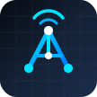

<p align="center">
  
</p>

# AetherMesh

AetherMesh is a LoRa mesh networking project with custom node firmware, an
Android companion app, and a browser-based firmware flasher. A phone connects to
a nearby node over Bluetooth LE, then that node relays messages and telemetry
across the long-range LoRa mesh.

```text
Android app <-> BLE <-> AetherMesh node <-> LoRa mesh <-> AetherMesh nodes
```

## Current Highlights

- Peer-to-peer LoRa mesh with broadcast, direct messages, route discovery, and
  packet deduplication.
- Android app with Chats, Nodes, Map, Settings, diagnostics, firmware updates,
  channel controls, and background BLE service support.
- Shared protobuf wire format across Android, BLE, and LoRa packets.
- BLE configuration for radio settings, GPS/position behavior, node naming,
  security keys, and device preferences.
- Firmware update flows from the app: ESP32-S3 boards use chunked BLE OTA
  `.bin` updates, while RAK boards can enter Nordic DFU for `.zip` updates.
- Browser flasher for first-time setup and recovery, published through GitHub
  Pages and bundled by GitHub Actions.
- Color T-Deck interface with hardware keyboard input and multiple full-screen
  status pages.
- Initial Elecrow CrowPanel 3.5 TFT target with SX1262 LoRa, BLE, OTA, and
  centered color dashboard output.

## Supported Hardware

| Board | Platform | Notes |
|-------|----------|-------|
| Heltec WiFi LoRa 32 V4 | ESP32-S3 | Default firmware target; OLED UI, GPS support, BLE OTA, USB/web flashing |
| Heltec WiFi LoRa 32 V3 | ESP32-S3 | Firmware target with OLED UI and USB/web flashing |
| LILYGO T-Deck | ESP32-S3 | Color screen UI, keyboard input, SX1262 LoRa, USB/web flashing |
| Elecrow CrowPanel Advance 3.5 TFT | ESP32-S3 | Initial CrowPanel firmware target with ILI9488 color UI and SX1262 LoRa |
| RAK WisBlock RAK4631 | nRF52840 | SX1262 LoRa, WisBlock GPS support, Nordic DFU update path |
| RAK3401 1W | nRF52840 | High-power RAK variant using the RAK4631 target base |
| LILYGO T-Echo | nRF52840 | T-Echo firmware target and web flasher UF2 flow |

## Repository Layout

| Path | What it is |
|------|------------|
| `app/` | Android companion app built with Kotlin and Jetpack Compose |
| `firmware/` | PlatformIO C++ firmware for ESP32-S3 and nRF52840 nodes |
| `proto/` | Protocol Buffer definitions shared by app and firmware |
| `web-flasher/` | GitHub Pages USB/UF2 firmware flasher |
| `web/` | ESP Web Tools style installer assets |
| `docs/` | Flashing notes, OTA notes, and development history |
| `tools/` | Helper scripts for staging firmware artifacts |

## Android App

The app is the day-to-day control surface for the mesh:

- Connects to nearby AetherMesh nodes over BLE and keeps the link alive in a
  foreground service.
- Sends and receives mesh chat messages.
- Shows known nodes, routes, telemetry, battery state, firmware versions, and
  GPS/map positions.
- Runs direct one-hop range tests with delayed-reply tracking and signal data
  from both ends of the radio link.
- Applies radio, GPS, channel, security, and device settings over BLE.
- Updates firmware wirelessly once a node already has an OTA-capable build.

Build with Android Studio or the Gradle wrapper:

```bash
cd app
./gradlew :app:assembleDebug
./gradlew :app:installDebug
```

Create `app/local.properties` with your Android SDK path if Android Studio has
not already created it:

```properties
sdk.dir=/path/to/Android/Sdk
```

## Firmware

Firmware is built with PlatformIO.

```bash
cd firmware
pio run -e heltec_v4
pio run -e heltec_v4 -t upload
pio device monitor
```

Current PlatformIO environments:

```text
heltec_v4
heltec_v3
rak4631
rak3401_1w
lilygo_t_echo
lilygo_t_deck
elecrow_crowpanel_35
```

The firmware includes LoRa transport, routing, BLE GATT services, telemetry,
GPS handling, board-specific display support, battery reporting, settings
storage, and firmware update control.

## Web Flasher

The web flasher is intended for first-time setup and recovery:

[https://silentwolf75.github.io/AetherMesh/](https://silentwolf75.github.io/AetherMesh/)

It supports the current target list in the UI:

- Heltec V4 and Heltec V3 as merged ESP32-S3 USB images.
- LILYGO T-Deck as a merged ESP32-S3 USB image.
- Elecrow CrowPanel 3.5 TFT as a merged ESP32-S3 USB image.
- RAK4631, RAK3401 1W, and LILYGO T-Echo as nRF52 UF2 drag-and-drop builds.

GitHub Actions builds the firmware and Android APK, writes a flasher manifest,
and deploys `web-flasher/` to GitHub Pages.

For local testing:

```bash
cd web-flasher
python -m http.server 8000
```

Then open `http://localhost:8000` in desktop Chrome, Edge, or another browser
with Web Serial support.

## BLE GATT Contract

| Item | UUID |
|------|------|
| Service | `a75e0001-8b01-4475-bf7d-9477b83e7953` |
| TX, phone to node | `a75e0002-8b01-4475-bf7d-9477b83e7953` |
| RX, node to phone | `a75e0003-8b01-4475-bf7d-9477b83e7953` |

Nodes advertise as `AetherMesh-XXXX`, where `XXXX` is the lower 16 bits of the
node ID in hex. Packets on BLE and LoRa are protobuf-encoded `MeshPacket`
messages.

## Regenerating Protobuf Code

The shared wire format lives in `proto/mesh.proto`.

- Android regenerates Kotlin classes automatically during Gradle builds.
- Firmware uses committed nanopb C files. After changing `mesh.proto`, run:

```bash
cd proto
python generate_proto.py
```

That writes `firmware/src/mesh.pb.c` and `firmware/src/mesh.pb.h`.

## Flashing Notes

- The first OTA-capable build must be installed over USB. A node that does not
  already include the OTA receiver cannot receive an OTA update.
- After that first bootstrap, Heltec/ESP32-S3 boards can update from the app
  using a `.bin` firmware file.
- RAK boards use their bootloader DFU path and a `.zip` package from the
  Android app.
- RAK4631, RAK3401 1W, and T-Echo can be installed from the web flasher with UF2
  drag-and-drop builds.
- Heltec, T-Deck, and CrowPanel ESP32-S3 targets can be installed from the web
  flasher with merged USB images.
- Do not flash firmware for one board family onto another board family.

## Status

AetherMesh is actively evolving hardware and app software. The Heltec, RAK,
T-Echo, T-Deck, and CrowPanel targets are all present in the repository, with
the T-Deck using a color screen UI and keyboard-driven interaction and the
CrowPanel using a touch-ready color dashboard.
